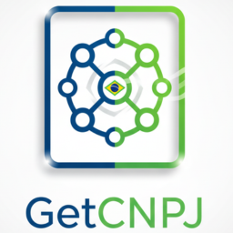

# GetCNPJ para PHP

[](https://www.php.net/)
[](LICENSE)

<p align="center">
  
</p>

Biblioteca PHP para consulta de CNPJ em APIs públicas brasileiras. Normaliza os dados retornados, controla o limite de requisições e tenta automaticamente o próximo provedor quando uma API falha.

## Recursos

- Quatro provedores: **CNPJ.WS**, **ReceitaWS**, **BrasilAPI** e **CNPJA**.
- Fallback automático, seguindo essa ordem de prioridade.
- CNPJ.WS como provedor principal e suporte a inscrições estaduais.
- Validação dos dígitos verificadores; aceita CNPJ formatado ou somente números.
- Rate limiting independente por provedor (3 requisições/minuto por padrão).
- Cliente HTTP PSR-18 injetável e Guzzle configurado por padrão.
- Objetos tipados e serializáveis com `json_encode()`.
- PHP puro sem configuração adicional.
- Auto-discovery, injeção de dependência, Facade e configuração publicável no Laravel.
- Service Discovery e configuração por `.env` no CodeIgniter 4.

## Requisitos

- PHP 8.1 ou superior.
- Extensão JSON.

## Instalação

Quando o pacote estiver publicado no Packagist:

```bash
composer require azumamagus/get-cnpj
```

Durante o desenvolvimento local:

```bash
composer install
```

## PHP puro

```php
<?php

require __DIR__ . '/vendor/autoload.php';

use GetCNPJ\CnpjClient;

$client = new CnpjClient();
$result = $client->get('03.312.791/0001-83');

if ($result->success) {
    $data = $result->data;

    echo "Razão Social: {$data->razaoSocial}\n";
    echo "Nome Fantasia: {$data->nomeFantasia}\n";
    echo "CNPJ: {$data->cnpj}\n";
    echo "Situação: {$data->situacao}\n";
    echo "Endereço: {$data->endereco->getEnderecoCompleto()}\n";
    echo "Provedor: {$data->provedor}\n";

    foreach ($data->inscricoesEstaduais as $inscricao) {
        echo "IE: {$inscricao}\n";
    }
} else {
    echo "Erro: {$result->errorMessage}\n";
    foreach ($result->errors as $error) {
        echo "- {$error->providerName}: {$error->errorMessage}\n";
    }
}
```

Um CNPJ com dígitos verificadores inválidos lança `GetCNPJ\Exceptions\InvalidCnpjException` antes de qualquer chamada HTTP.

## Laravel

O Laravel encontra automaticamente o Service Provider e a Facade declarados pelo pacote. Depois do `composer require`, nenhuma inclusão manual em `bootstrap/providers.php` ou `config/app.php` é necessária.

### Injeção de dependência

```php
<?php

namespace App\Http\Controllers;

use GetCNPJ\CnpjClient;

final class EmpresaController extends Controller
{
    public function show(string $cnpj, CnpjClient $client)
    {
        return response()->json($client->get($cnpj));
    }
}
```

O `CnpjClient` é registrado como singleton no container. Também pode ser resolvido diretamente:

```php
$client = app(\GetCNPJ\CnpjClient::class);
```

### Facade

O alias `GetCNPJ` é registrado por auto-discovery:

```php
use GetCNPJ\ProviderType;

$result = \GetCNPJ::get('03.312.791/0001-83');
$brasilApi = \GetCNPJ::getFromProvider('03312791000183', ProviderType::BrasilAPI);
```

Se preferir importar a classe explicitamente:

```php
use GetCNPJ\Integrations\Laravel\Facades\GetCNPJ;

$result = GetCNPJ::get('03.312.791/0001-83');
```

### Configuração do Laravel

Publique o arquivo opcional `config/getcnpj.php`:

```bash
php artisan vendor:publish --tag=getcnpj-config
```

As opções também podem ser definidas no `.env`:

```dotenv
GETCNPJ_TIMEOUT=30
GETCNPJ_MAX_REQUESTS_PER_MINUTE=3
GETCNPJ_ENABLE_CNPJ_WS=true
GETCNPJ_ENABLE_RECEITA_WS=true
GETCNPJ_ENABLE_BRASIL_API=true
GETCNPJ_ENABLE_CNPJA=true
```

Quando a aplicação possui uma implementação de `Psr\Http\Client\ClientInterface` registrada no container, o pacote a utiliza automaticamente. Caso contrário, utiliza o Guzzle interno.

## CodeIgniter 4

O CodeIgniter 4 descobre automaticamente o arquivo `GetCNPJ\Config\Services` por meio do namespace PSR-4 do Composer. Com o Service Discovery habilitado — configuração padrão do framework — o cliente fica disponível como um serviço compartilhado:

```php
<?php

namespace App\Controllers;

use CodeIgniter\HTTP\ResponseInterface;

final class Empresa extends BaseController
{
    public function show(string $cnpj): ResponseInterface
    {
        $result = service('getCnpj')->get($cnpj);

        return $this->response->setJSON($result);
    }
}
```

Chamadas repetidas a `service('getCnpj')` retornam a mesma instância. Para solicitar uma nova instância:

```php
$client = single_service('getCnpj');
```

Também é possível acessar a classe de serviços diretamente:

```php
$client = \GetCNPJ\Config\Services::getCnpj();
```

### Configuração do CodeIgniter 4

Use as propriedades da classe `GetCNPJ\Config\GetCnpj` no `.env`. O CodeIgniter converte os valores para os tipos declarados:

```dotenv
getcnpj.timeout = 30
getcnpj.maxRequestsPerMinute = 3
getcnpj.enableCnpjWs = true
getcnpj.enableReceitaWs = true
getcnpj.enableBrasilApi = true
getcnpj.enableCnpja = true
```

Se o projeto desabilitou `discoverInComposer` em `app/Config/Modules.php`, use `\GetCNPJ\Config\Services::getCnpj()` diretamente ou inclua `azumamagus/get-cnpj` na lista de pacotes permitidos para descoberta.

## Provedor específico

```php
use GetCNPJ\CnpjClient;
use GetCNPJ\ProviderType;

$client = new CnpjClient();

$result = $client->getFromProvider(
    '03312791000183',
    ProviderType::BrasilAPI,
);
```

Também é possível informar o nome como string: `CNPJWS`, `ReceitaWS`, `BrasilAPI` ou `CNPJA`. A comparação não diferencia maiúsculas de minúsculas.

## Configuração

```php
use GetCNPJ\CnpjClient;
use GetCNPJ\CnpjClientOptions;

$options = new CnpjClientOptions(
    timeout: 60,
    maxRequestsPerMinute: 5,
    enableCnpjWs: true,
    enableReceitaWs: true,
    enableBrasilApi: true,
    enableCnpja: false,
);

$client = new CnpjClient(options: $options);
$result = $client->get('03312791000183');
```

## Cliente HTTP customizado

Qualquer cliente que implemente `Psr\Http\Client\ClientInterface` pode ser usado:

```php
use GetCNPJ\CnpjClient;
use GuzzleHttp\Client;

$http = new Client([
    'timeout' => 15,
    'proxy' => 'http://proxy.exemplo:8080',
    'http_errors' => false,
]);

$client = new CnpjClient(httpClient: $http);
```

## Modelo retornado

Em caso de sucesso, `$result->data` é um `CnpjData` com os campos:

- `cnpj`, `razaoSocial`, `nomeFantasia`, `dataAbertura`, `situacao`, `dataSituacao`;
- `tipo`, `porte`, `naturezaJuridica`, `capitalSocial`;
- `endereco`, `atividadePrincipal`, `atividadesSecundarias`;
- `quadroSocietario`, `telefones`, `email`, `inscricoesEstaduais`;
- `simples`, `ultimaAtualizacao` e `provedor`.

Datas são instâncias de `DateTimeImmutable`. O resultado completo pode ser convertido para JSON:

```php
echo json_encode($result, JSON_PRETTY_PRINT | JSON_UNESCAPED_UNICODE);
```

## Rate limiting

O algoritmo Sliding Window registra limites separadamente para cada provedor. Ao atingir o limite, a chamada aguarda até a requisição mais antiga sair da janela de um minuto. O estado fica em memória e vale para a instância atual do cliente.

## Testes

```bash
composer test
```

Os testes comuns não consultam as APIs públicas: usam respostas HTTP simuladas para verificar validação, fallback, mapeamento e rate limiting. A suíte também inicializa ambientes reais do Laravel e CodeIgniter 4 para validar container, Facade, configuração e serviços compartilhados.

## Publicação no Packagist

1. Crie um repositório público no GitHub e envie estes arquivos.
2. Confirme o nome definitivo em `composer.json` (`azumamagus/get-cnpj`).
3. Acesse [packagist.org/packages/submit](https://packagist.org/packages/submit) e informe a URL do repositório.
4. Crie uma tag semântica e envie-a ao GitHub:

```bash
git tag -a v1.0.0 -m "Primeira versão estável"
git push origin v1.0.0
```

O Packagist usa as tags Git como versões instaláveis. Recomenda-se configurar o hook do GitHub exibido pelo Packagist para atualizar automaticamente as próximas versões.

## APIs utilizadas

- [CNPJ.WS](https://publica.cnpj.ws/)
- [ReceitaWS](https://receitaws.com.br/)
- [BrasilAPI](https://brasilapi.com.br/)
- [CNPJA](https://cnpja.com/)

Respeite os termos e limites de uso de cada serviço. As APIs podem ficar indisponíveis ou alterar seus contratos sem aviso.

## Licença

MIT. Consulte [LICENSE](LICENSE).
